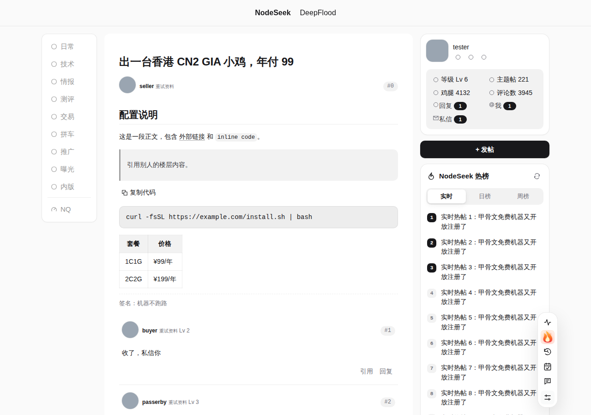
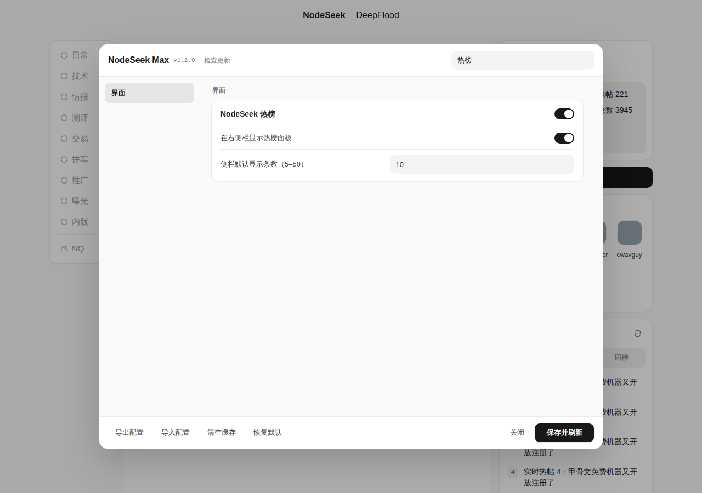

# NodeSeek Max

NodeSeek / DeepFlood 全能增强用户脚本：把 **NodeSeek++**、**redirect 外链跳转**、**NodeSeek 热榜插件**、**NodeSeek 自动屏蔽黑名单用户通知** 四个脚本合并成一个，并新增一套参考 sing-box 面板与 Sub-Store 液态玻璃风格的 **现代化主题**、**侧栏版块导航整理**。

所有功能都能在设置里单独开关，一个脚本、一套设置、一份请求队列，不再有多个脚本互相打架。

| 首页（简洁风格 · Inter 字体） | 帖子页（深色） |
| --- | --- |
|  |  |
| **帖子页（浅色）** | **设置面板** |
|  |  |

> 截图来自仓库自带的冒烟测试：用模拟的 NodeSeek 页面结构渲染，接口数据为假数据，仅用于展示脚本效果。

## 安装

1. 安装 [Tampermonkey](https://www.tampermonkey.net/)（或 Violentmonkey 等兼容的脚本管理器）。
2. 打开 **[安装 NodeSeek Max](https://raw.githubusercontent.com/Ethan2258/Nodeseek-max/main/nodeseek-max.user.js)**，在脚本管理器里点「安装」。各版本的发布说明与安装文件也可以在 [Releases](https://github.com/Ethan2258/Nodeseek-max/releases) 找到。
3. **停用或卸载原来的四个脚本**（NodeSeek++、redirect 外链跳转、NodeSeek 热榜插件、NodeSeek 自动屏蔽黑名单用户通知），否则功能会重复执行。
4. 刷新 [NodeSeek](https://www.nodeseek.com/)，点右下角工具栏最下方的设置图标，或在脚本管理器菜单里打开「NodeSeek Max 设置」。

脚本每次进入论坛都会检查更新（之后每 6 小时一次），发现新版本时提醒；也可以在设置顶部点「检查更新」。

**从 NodeSeek++ 迁移配置**：在 NodeSeek++ 的设置里「导出配置」，再到 NodeSeek Max 的设置里「导入配置」即可，格式完全兼容。

## 功能

### 现代化主题（新增）

- **两种风格**：简洁（默认，参考 sing-box 面板：实心白卡 + 发丝描边 + 大圆角）与液态玻璃（参考 [Sub-Store](https://github.com/Ethan2258/sub-store)：半透明卡片 + 顶部高光）。
- **字体**：拉丁字母用 Inter，数字、楼层号、代码用 JetBrains Mono，中文继续用系统的苹方 / 鸿蒙 / 微软雅黑。字体文件只在第一次从 jsDelivr 下载（约 88 KB），校验 woff2 签名和 SHA-256 后存进脚本管理器，以后直接从本地加载，不再联网，也不受站点 CSP 影响。中文引号、破折号、省略号仍用中文字体，保持全角字形。也可以选「系统字体」完全不联网。
- 黑白灰中性配色（另有靛蓝、湛蓝、翡翠绿、紫罗兰、琥珀、玫红与自定义强调色），自动适配站点深色模式，可选跟随系统深色模式。
- 帖子列表与评论：默认「分隔行 + 悬停高亮」（列表本身就在一张白卡片里，不再卡片套卡片），也可选独立卡片或站点默认。
- 帖子页：大标题、作者信息行、楼层号胶囊、签名档分隔、回复编辑器卡片、跳转到楼层时高亮目标楼层、顶部阅读进度条；正在阅读的帖子标题不再被「已读」标记变灰。
- 右侧用户卡片：黑白灰配色，统计区改为中性灰底（替换原来的黄色），「发帖」按钮改为强调色（默认黑色），未读计数改为黑白徽章，头像圆角、操作图标悬停高亮。
- 正文排版：行高、标题、链接、引用、行内代码、代码块、表格、图片统一优化。
- 毛玻璃吸顶导航栏、纤细滚动条、弹簧回弹与淡入动效（系统开启「减弱动态效果」时全部关闭）。
- 默认去掉站点的网格背景（可在设置里保留）。
- 在页面渲染之前就生效，不会先闪一下原版界面。NodeSeek++ 的设置面板、工具栏、弹窗同步换成同一套风格。
- 性能：简洁风格完全不使用 `backdrop-filter` 模糊；工具栏（内含持续播放的心电图动画）永远不放在模糊层上；不给列表条目加入场动画；设置面板去掉遮罩模糊与分类标题模糊，滚动同步每帧最多一次、搜索输入防抖，功能条目使用 `content-visibility` 按需渲染。

### 侧栏版块导航（新增）

- **去重**：顶栏和左侧栏都有一套版块分类。默认在左侧栏可见时隐藏顶栏里重复的版块；窄屏或手机上侧栏被隐藏、收进抽屉时，顶栏版块自动恢复。也可以改成「隐藏侧栏重复项」或「不处理」。
- **隐藏版块**：默认隐藏 生活、Dev、贴图、沙盒，名单可在设置里改。按版块名称文字识别导航，不依赖站点的链接格式或类名；识别完成后不再随页面变化反复扫描。
- **快捷入口**：版块列表末尾加入 **NQ**（[NodeQuality](https://nodequality.com) 测机），样式自动跟随原生版块条目，新标签页打开。可在设置里按「名称|网址|图标|提示」每行添加更多入口。

### 侧栏热榜（合并自「NodeSeek 热榜插件」）

- 右侧栏显示实时 / 日榜 / 周榜，前 10 条，可展开全部；首页放在「快捷入口」面板上方，帖子页等页面自动放进右侧栏。
- 与工具栏里的热榜弹窗共用同一份缓存，不会重复请求。
- 只在标签页可见、且面板滚动到视口内时自动刷新：实时榜 1 分钟、日榜和周榜 5 分钟。

### 黑名单通知屏蔽（合并自「NodeSeek 自动屏蔽黑名单用户通知」）

- 读取站点官方黑名单，隐藏黑名单用户发来的 @、回复和私信通知。
- 开启「紧凑消息中心」时直接在数据层过滤，被屏蔽的人不会出现在通知和会话列表里；用原版通知页时按 `/space/用户ID`、私信 `to=用户ID` 和用户名定位通知行并隐藏。
- 只在通知页同步名单，缓存 5 分钟；不会像原脚本那样每个页面每 5 分钟都请求一次。
- 在用户卡片上屏蔽 / 解除屏蔽后，通知过滤立即更新。

### 外链跳转（合并自「redirect 外链跳转」1.67.0）

- 在 document-start 阶段识别各站的外链中转页并直接跳到目标地址：知乎、简书、微博、QQ 邮箱、QQ、微信、企业微信、贴吧、CSDN、YouTube、豆瓣、Pixiv、Google、掘金、Gitee、Steam、语雀、哔哩哔哩、少数派、飞书、腾讯文档、金山文档、石墨文档、酷安、LINUX DO 等 60 多个站点。
- NodeSeek / DeepFlood 的 `/jump` 中转页同样直达，并能展开多层嵌套的 `/jump`；遵循「内容增强 → 外链直达」开关。
- 只放行 http / https 目标，不会跳到 `javascript:` 等危险地址。

### NodeSeek++ 原有功能

阅读增强（评论自动翻页、阅读历史、已读标记、代码高亮、帖子预览、长文折叠、外链直达）、帖子互动（原生列表增强、按需互动计数、回帖足迹）、用户资料（等级、加入天数、参考分徽章、悬浮资料卡）、内容过滤、RSS 关键词监控、抽奖追踪、多图床上传、紧凑消息中心、签到、回复快捷键等，详见 [NodeSeek++ 项目说明](https://github.com/rirh/nodeseek-plus#readme)。

已移除：列表里的「快速回复」按钮与快捷回复模板、AI 写作助手。

页面变化后的模块回调改为在浏览器空闲时执行（`requestIdleCallback`），滚动、输入时不再被大量 DOM 扫描卡住。

## 合并时处理的冲突

| 冲突 | 处理 |
| --- | --- |
| NodeSeek++ 的「外链直达」与 redirect 脚本都处理 `/jump` | 统一在 document-start 处理一次，遵循同一个开关 |
| NodeSeek++ 的黑名单按钮与黑名单通知脚本各自请求名单 | 合并为一个模块、一次请求、一份缓存 |
| 工具栏热榜弹窗与侧栏热榜面板各自请求数据 | 共用缓存与请求，切换互不重复 |
| NodeSeek++ 悬浮工具栏（right: 72px）压住右侧栏热榜与用户卡片 | 桌面端内容区右侧留白足够时，工具栏停靠到内容区外侧；空间不够或手机端保持原位 |
| NodeSeek++ 深色模式给工具栏、预览卡写死 `#262626` 配色 | 主题接管这些变量，与整站配色一致 |
| 卡片悬停若用 `transform` 上浮，会让卡片里的 fixed 浮层（用户资料卡）错位 | 改用阴影与描边变化，按压回弹只在按下瞬间生效 |
| 毛玻璃顶栏的 `backdrop-filter` 会让顶栏内的下拉菜单定位异常 | 模糊效果放在 `::before` 伪元素上，顶栏本身不受影响；原本就是 fixed / sticky 的顶栏不改定位 |
| 「帖子过滤」用 `hidden` 隐藏帖子，可能被卡片样式覆盖 | 主题对被隐藏的帖子、评论保底 `display: none` |
| 主题的引用块样式会覆盖 NodeSeek++ 的 Callout | 引用样式排除 Callout |
| 顶栏与侧栏重复的版块分类 | 见「侧栏版块导航」 |
| document-start 时 `<html>` 尚未创建，样式与动画库初始化会失败 | 样式与根属性等根元素出现后立即挂上；动画库推迟到首次使用时初始化 |

## 开发

```bash
npm install
npx playwright install chromium
npm run check   # 语法检查 + .meta.js 与版本一致性
npm test        # 冒烟测试：用模拟页面在 Chromium 中跑一遍所有新增功能
npm run meta    # 修改脚本头部后重新生成 nodeseek-max.meta.js
```

- `nodeseek-max.user.js`：可直接安装的完整脚本。
- `nodeseek-max.meta.js`：只含头部，供脚本管理器检查更新。
- 发布新版本：同时修改头部 `@version`、脚本里的 `NSMAX_VERSION` 和 `package.json` 的版本号，运行 `npm run meta`，并在 `CHANGELOG.md` 顶部写一节 `## 版本号`。合并到 main 且 CI 通过后，`Release` 工作流会自动创建 `v版本号` 标签与 GitHub Release（附 `nodeseek-max.user.js`、`nodeseek-max.meta.js`，说明取自 CHANGELOG 对应一节）；版本号没变的提交不会重复发布。也可以在 Actions 页面手动运行 Release。
- 设置 `NSMAX_FONT_DIR` 指向 `@fontsource-variable` 的字体文件目录可运行字体缓存测试；设置 `NSMAX_SCREENSHOTS=目录` 会保存截图。

## 许可证与致谢

本项目以 **GPL-3.0-only** 发布（见 [LICENSE](LICENSE)），因为它基于以 GPL-3.0-only 发布的 NodeSeek++。

- [NodeSeek++](https://github.com/rirh/nodeseek-plus) 26.917.1446 — GPL-3.0-only
- [redirect 外链跳转](https://github.com/sakura-flutter/tampermonkey-scripts) 1.67.0 — sakura-flutter，MIT
- [NodeSeek 热榜插件](https://greasyfork.org/scripts/560065) 1.1 — [作者](https://www.nodeseek.com/space/10539)，MIT；热榜数据来自 [bimg.eu.org](https://bimg.eu.org)
- NodeSeek 自动屏蔽黑名单用户通知 2.0
- 字体：[Inter](https://rsms.me/inter/) 与 [JetBrains Mono](https://www.jetbrains.com/lp/mono/)（SIL Open Font License 1.1），经 [Fontsource](https://fontsource.org) 分发
- 内置第三方库（date-fns、GSAP、highlight.js、Viewer.js、Marked）的许可声明保留在脚本头部注释中
