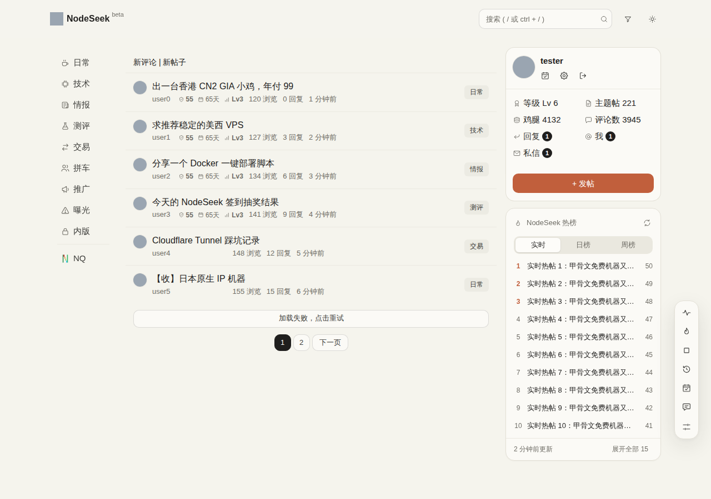
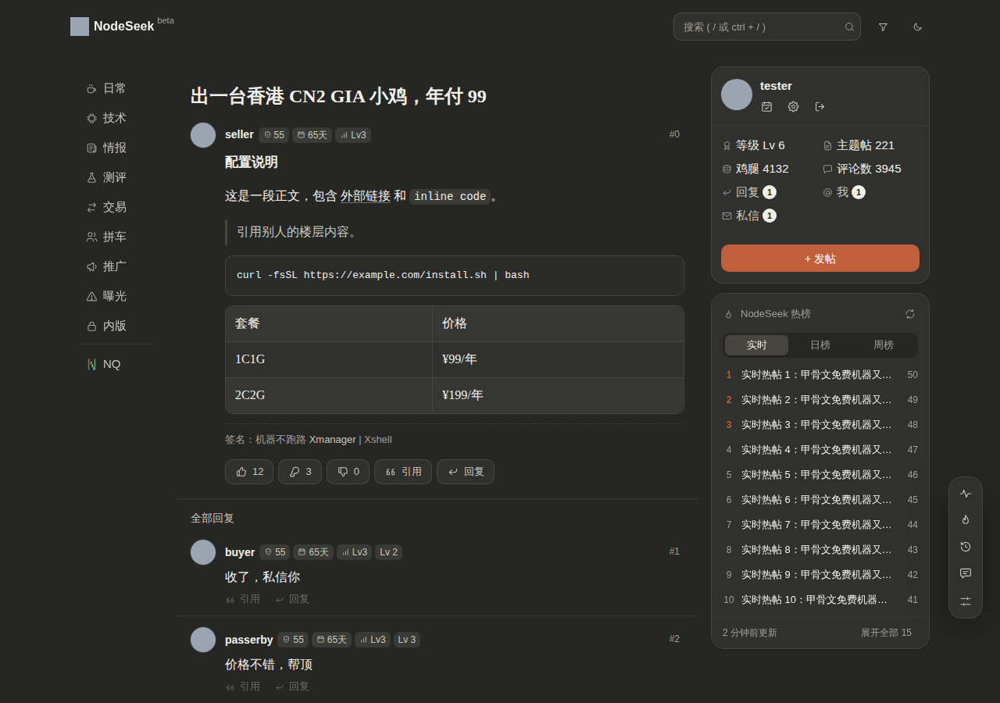
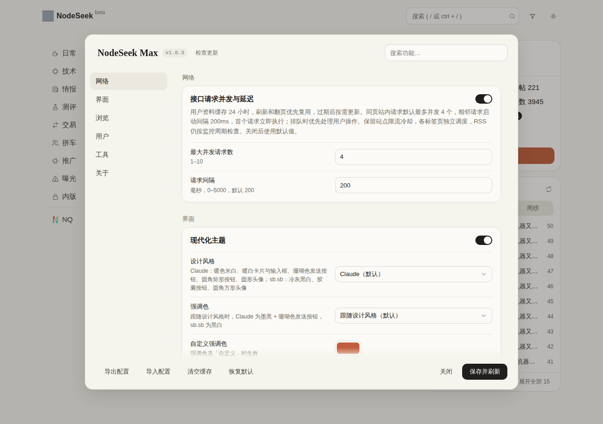

# NodeSeek Max

NodeSeek / DeepFlood 增强脚本：把 NodeSeek++、redirect 外链跳转、NodeSeek 热榜插件、NodeSeek 自动屏蔽黑名单用户通知合成一个，并带一套参考 Claude 网页版的主题。每项功能都能在设置里单独开关。

| 首页 | 帖子页（深色） |
| --- | --- |
|  |  |
| **私信** | **设置** |
|  |  |

## 安装

1. 电脑浏览器装好 [Tampermonkey](https://www.tampermonkey.net/) 或 Violentmonkey。
2. 打开 **[nodeseek-max.user.js](https://raw.githubusercontent.com/Ethan2258/Nodeseek-max/main/nodeseek-max.user.js)** 安装（历史版本见 [Releases](https://github.com/Ethan2258/Nodeseek-max/releases)）。
3. 停用原来的四个脚本，避免重复执行。

设置在右下角工具栏最下方，或脚本管理器菜单「NodeSeek Max 设置」；NodeSeek++ 的配置可以直接导入。只想要主题，可用 [Stylus](https://add0n.com/stylus.html) 安装 [nodeseek-max.user.css](https://raw.githubusercontent.com/Ethan2258/Nodeseek-max/main/theme/nodeseek-max.user.css)。

## 功能

- **主题**：暖米白底、暖白卡片、珊瑚色发送按钮，界面用 Inter、正文用衬线体；圆角、字号、描边、阴影各只用少数几档，深色模式为暖炭灰。评论框、私信、设置页、发帖页和各个工具弹窗一并适配，页面渲染前生效，刷新不闪。也可切回 sb.sb 的冷灰风格。
- **顶栏与导航**：顶栏只留标志、搜索、关键词屏蔽和深浅色（浅色 / 深色 / 跟随系统）；去掉重复版块，默认隐藏生活、Dev、贴图、沙盒、DeepFlood，侧栏加入 NQ（NodeQuality）入口。
- **评论框**：图床按钮和「发布评论」在同一行，默认上传到欧记图床（也支持 NodeImage 等）。
- **关键词屏蔽**：点顶栏的屏蔽按钮随时添加关键词，帖子列表和侧栏热榜立即隐藏命中的帖子；不分大小写，支持 /正则/，可选同时匹配评论内容，也能按用户名屏蔽。
- **侧栏热榜**：实时 / 日榜 / 周榜。
- **黑名单**：隐藏黑名单用户的 @、回复和私信通知。
- **外链直达**：60 多个站点的外链中转页和 NodeSeek `/jump` 直接跳转。
- **NodeSeek++ 原有功能**：自动翻页、阅读历史、用户等级、内容过滤、RSS 监控等（去掉了快速回复与 AI 写作）。

导航或顶栏识别不对时，在脚本管理器菜单点「NodeSeek Max：复制导航诊断信息」，把内容发到 [Issues](https://github.com/Ethan2258/Nodeseek-max/issues)。

## 开发

```bash
npm install && npx playwright install chromium
npm run check     # 语法、meta 与主题 CSS 同步检查
npm test          # 冒烟测试（模拟页面）
npm run meta      # 重新生成 nodeseek-max.meta.js
npm run css       # 重新生成 theme/ 下的独立 CSS
npm run upstream  # 检查上游脚本是否有新版本
```

- 发版：改 `@version`、`NSMAX_VERSION`、`package.json` 的版本号，并在 `CHANGELOG.md` 写对应一节；合并到 main、CI 通过后自动发布 Release。
- 上游：NodeSeek++、redirect 外链跳转、NodeSeek 热榜插件发布新版本时，`Upstream` 工作流会开 issue，合并步骤见 [upstream/](upstream/)。

## 许可证

GPL-3.0-only（基于 NodeSeek++），见 [LICENSE](LICENSE)。

致谢：[NodeSeek++](https://github.com/rirh/nodeseek-plus)（GPL-3.0）、[redirect 外链跳转](https://github.com/sakura-flutter/tampermonkey-scripts)（MIT）、[NodeSeek 热榜插件](https://greasyfork.org/scripts/560065)（MIT，数据来自 [bimg.eu.org](https://bimg.eu.org)）、NodeSeek 自动屏蔽黑名单用户通知；字体 [Inter](https://rsms.me/inter/) 与 [JetBrains Mono](https://www.jetbrains.com/lp/mono/)（OFL 1.1）。内置第三方库的许可声明保留在脚本头部。
