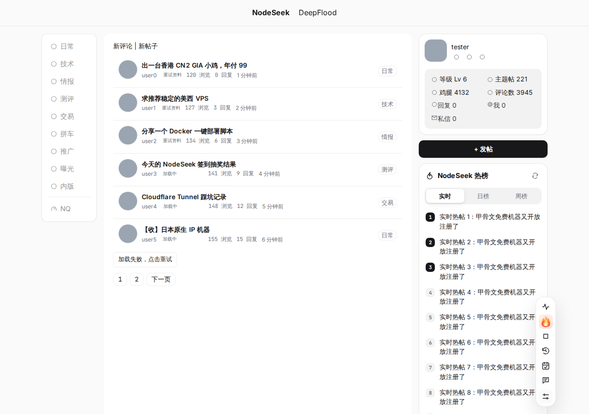

# NodeSeek Max

NodeSeek / DeepFlood 增强脚本：合并 NodeSeek++、redirect 外链跳转、NodeSeek 热榜插件、NodeSeek 自动屏蔽黑名单用户通知四个脚本，并加入 sing-box 风格的简洁主题。所有功能都能在设置里单独开关。

| 首页 | 帖子页（深色） |
| --- | --- |
|  |  |

## 安装

1. 安装 [Tampermonkey](https://www.tampermonkey.net/) 或 Violentmonkey（电脑浏览器）。
2. 打开 **[nodeseek-max.user.js](https://raw.githubusercontent.com/Ethan2258/Nodeseek-max/main/nodeseek-max.user.js)** 安装（各版本见 [Releases](https://github.com/Ethan2258/Nodeseek-max/releases)）。
3. 停用原来的四个脚本，避免重复执行。
4. 设置入口：右下角工具栏最下方的图标，或脚本管理器菜单「NodeSeek Max 设置」。

只要主题：用 [Stylus](https://add0n.com/stylus.html) 安装 [nodeseek-max.user.css](https://raw.githubusercontent.com/Ethan2258/Nodeseek-max/main/theme/nodeseek-max.user.css)。NodeSeek++ 的配置可直接导入。

## 功能

- **主题**：参考 Claude（claude.ai 网页版）的界面设计——暖色米白底、白色卡片、珊瑚色发送按钮、8px 圆角按钮、圆形头像、统一线条图标、界面 Inter + 正文衬线体，评论框与私信是 Claude 式的大圆角输入框，深色模式为暖炭灰；也可在设置里切换回 sb.sb 的冷灰风格。评论区、设置页、发帖页和 NodeSeek++ 的各个工具弹窗一并适配；渲染前生效，刷新不闪原版界面。
- **精简顶栏**：桌面端只保留站点标志、标题、搜索框和深浅色切换。
- **版块导航**：去掉顶栏与侧栏重复的版块；默认隐藏 生活、Dev、贴图、沙盒、DeepFlood；侧栏加入 NQ（NodeQuality）入口。
- **评论框**：统一线条图标，图床按钮与「发布评论」同一行；默认上传到欧记图床 image.110726.com（可填 API Token，也支持 NodeImage 等）。
- **侧栏热榜**：实时 / 日榜 / 周榜。
- **黑名单**：隐藏黑名单用户的 @、回复和私信通知。
- **外链直达**：60 多个站点的外链中转页与 NodeSeek `/jump` 直接跳转。
- **NodeSeek++ 原有功能**：自动翻页、阅读历史、用户等级、内容过滤、RSS 监控、紧凑消息中心等（已移除快速回复与 AI 写作）。

上游 NodeSeek++、redirect 外链跳转、NodeSeek 热榜插件发布新版本时，`Upstream` 工作流会开 issue，合并后随新版本发布（见 [upstream/](upstream/)）。

导航或顶栏识别不对时，在脚本管理器菜单点「NodeSeek Max：复制导航诊断信息」，把内容发到 [Issues](https://github.com/Ethan2258/Nodeseek-max/issues)。

## 开发

```bash
npm install && npx playwright install chromium
npm run check   # 语法、meta 与主题 CSS 同步检查
npm test        # 冒烟测试（模拟页面）
npm run meta    # 重新生成 nodeseek-max.meta.js
npm run css     # 重新生成 theme/ 下的独立 CSS
npm run upstream  # 检查上游脚本是否有新版本
```

发版：改 `@version`、`NSMAX_VERSION`、`package.json` 版本号并在 `CHANGELOG.md` 写对应一节；合并到 main 且 CI 通过后自动发布 Release。

## 许可证

GPL-3.0-only（基于 NodeSeek++），见 [LICENSE](LICENSE)。

致谢：[NodeSeek++](https://github.com/rirh/nodeseek-plus)（GPL-3.0）、[redirect 外链跳转](https://github.com/sakura-flutter/tampermonkey-scripts)（MIT）、[NodeSeek 热榜插件](https://greasyfork.org/scripts/560065)（MIT，数据来自 [bimg.eu.org](https://bimg.eu.org)）、NodeSeek 自动屏蔽黑名单用户通知；字体 [Inter](https://rsms.me/inter/) 与 [JetBrains Mono](https://www.jetbrains.com/lp/mono/)（OFL 1.1）。内置第三方库的许可声明保留在脚本头部。
